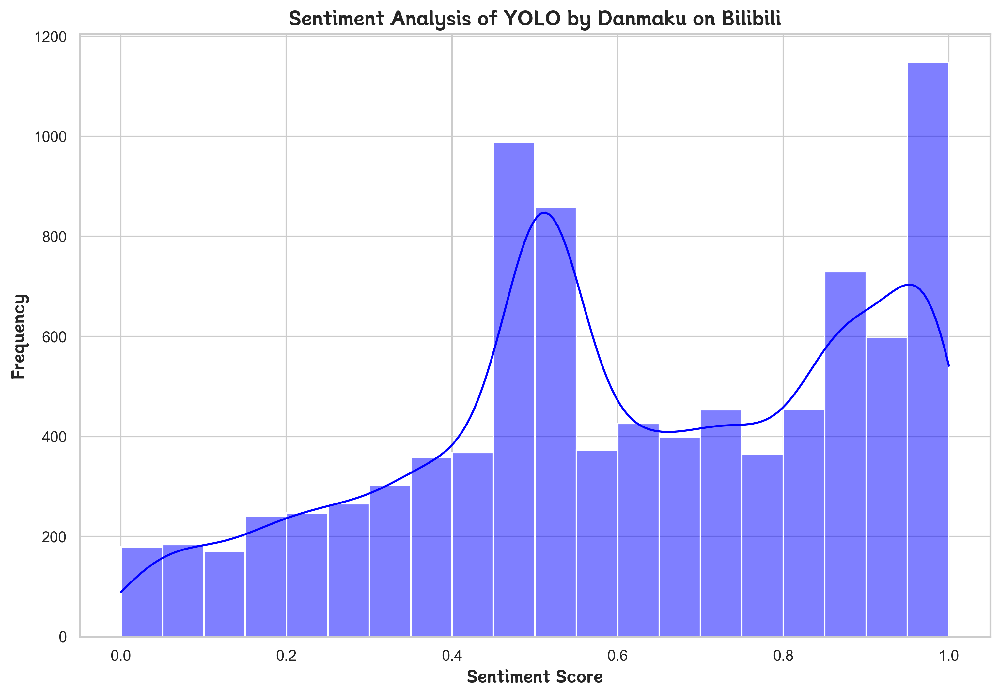

### YOLO Sentiment Analysis by Danmaku on Bilibili

This project explores the application of sentiment analysis on danmaku (bullet-screen comments) collected from Bilibili, a popular video-sharing platform. Leveraging natural language processing (NLP) techniques, the project analyzes the sentiment distribution of user comments and visualizes key insights, such as the prevalence of positive and negative sentiments.

#### Key Highlights:
- **Sentiment Distribution**: The histogram below demonstrates the frequency of sentiment scores, revealing patterns in user sentiments.
  
  

- **Word Cloud Visualization**: A word cloud highlights the most frequently used words in the danmaku comments, providing insights into user discussions.

  
  
For more details, please visit the [GitHub repository](https://github.com/samklein112/You-Only-Live-Once-Sentiment-Analysis-by-Danmaku-on-Bilibili).
